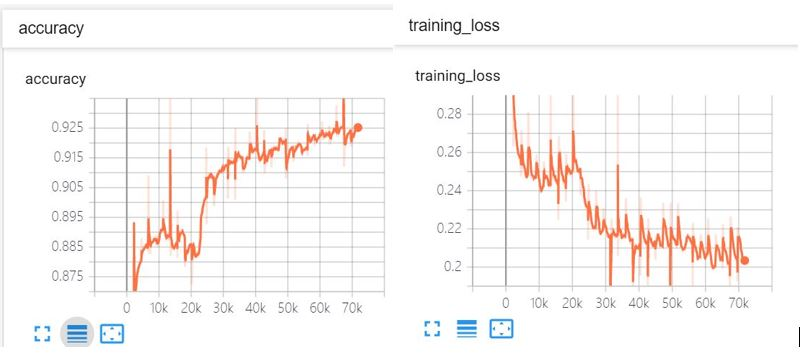

# PSENet-Plus
PSENet Pytorch版本的优化与增强（python2.7or3.6 + Pytorch1.3)

### 原作者版本：<https://github.com/whai362/PSENet>

### 新版本特性：

- [x] 原作者pretrained-ic15模型在一般场景下表现不佳，本文在超过20K的数据样本上训练得到新模型。模型地址：https://pan.baidu.com/s/13VX--LLh2_AEzNjOgaB_Lw 请勿商用。

- [x] 在训练代码中增添Tensorboard可视化。

  

- [x] 增添了单张图片测试pse_enjoy.py并封装，易于移植到综合项目。

- [x] pse_enjoy.py支持CPU模式，但注意训练和批测试仍需在CUDA环境中进行。

- [ ] 优化pse中c++内容，提高推理速度。(not released at present for IP reason)

- [x] 迁移到python3.6环境。（python2.7版本和python3.6版本切换，解决方案如下）

  > 修改pse/include/pybind11/detail/common.h中的第112~114：
  > #include <python3.6m/Python.h>
  > #include <python3.6m/frameobject.h>
  > #include <python3.6m/pythread.h>
  > 为：
  > #include <python2.7/Python.h>
  > #include <python2.7/frameobject.h>
  > #include <python2.7/pythread.h>
  >
  > 主要是pybind的写法原因，通常可在usr/include目录下找需要的python版本头文件

### 新版本说明：

- 训练：注意batchsize与GPU显存的匹配，24G TITAN 单张 只能支持batchsize = 8(约占用15G显存)

```bash
$ CUDA_VISBLE_DEVICES=0,1,2 python pse_train.py (--flags)
```

- 批量测试：将测试图片直接放在./testdata目录下即可，可在./testdata_results里看结果

```bash
$ python pse_test.py (--flags)
```

- 单张测试：

```bash
$ python pse_enjoy.py --imgfile XXX.png --modelpath YYY/checkpoint.pth.tar
```

- 如果报pse错，请重新编译pse文件夹中c++工程
- 如果编译后找不到.so文件，不要忘记修改环境变量，使支持c++opencv

```bash
$ export PKG_CONFIG_PATH=/mnt/lrzhang/opencv-3.4.6/build/install/lib64/pkgconfig:$PKG_CONFIG_PATH
$ export LD_LIBRARY_PATH=/mnt/lrzhang/opencv-3.4.6/build/install/lib64/:$LD_LIBRARY_PATH
```

### 在ICPR2018淘宝测试集上:


### 在MSRA-TD500微软测试集上：


